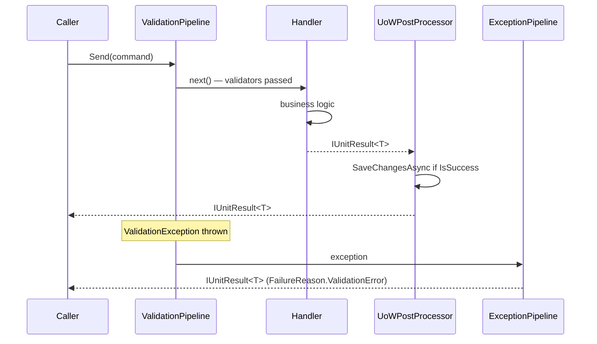
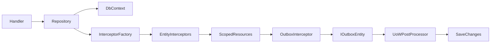
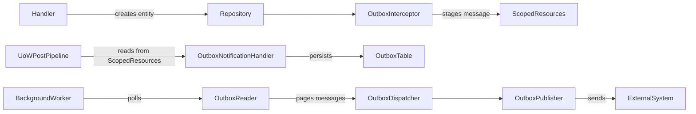

# Architecture overview

This page explains how IDFCR's packages compose into a coherent application architecture. Read [Results and flow](results-and-flow.md) and [Handlers and pipelines](handlers-and-pipelines.md) for a deeper treatment of individual pieces.

---

## Core idea

IDFCR standardises three things:

1. **Result contracts** — every operation returns one of the `IUnitResult*` types.
2. **Request/handler conventions** — handler intent is expressed as a strongly typed MediatR request.
3. **Infrastructure registration** — capabilities register themselves via extension methods; consumers call those methods rather than wiring DI manually.

Everything else — business logic, domain models, persistence technology — stays in consumer code.

---

## Package layers

```
┌───────────────────────────────────────────────────────────┐
│  Consumer application (your business logic)               │
│  Commands · Queries · Validators · Domain services        │
└────────────────────────┬──────────────────────────────────┘
                         │ MediatR Send / Publish
┌────────────────────────▼──────────────────────────────────┐
│  Handler + pipeline layer                                  │
│  ValidationPipeline · GenericDefaultExceptionPipeline      │
│  UnitOfWorkPostPipelineProcessor                           │
│  (IDFCR.Abstractions.Mediator.Extensions)                  │
└────────────────────────┬──────────────────────────────────┘
                         │ handler returns IUnitResult<T>
┌────────────────────────▼──────────────────────────────────┐
│  Result contracts                                          │
│  IUnitResult · IUnitResult<T> · IUnitResultCollection<T>  │
│  IPagedUnitResult<T> · IChainedUnitResult                  │
│  (IDFCR.Abstractions.Results)                              │
└────────────────────────┬──────────────────────────────────┘
          ┌──────────────┼──────────────────┐
          ▼              ▼                  ▼
   HTTP response    gRPC status       Outbox entity
   (.AsHttp())   (UnitResultExtensions)  (IOutboxEntity)
```

---

## Request flow

The following shows what happens when MediatR dispatches a request:



Key points:
- The **ValidationPipeline** runs registered `IValidator<TRequest>` implementations before the handler.
- The **UnitOfWorkPostPipelineProcessor** calls `SaveChangesAsync` only when the result is successful and the request implements `IUnitOfWorkRequest` with `CommitChanges = true`.
- The **GenericDefaultExceptionPipeline** catches any unhandled exception and converts it to a typed `IUnitResult*`, preventing raw exceptions from leaking to callers.

---

## Persistence flow



- **Repositories** call `IEntityInterceptorFactory` after persistence operations.
- **Interceptors** (e.g., audit timestamp, outbox) run in order and share state via `IScopedResources`.
- The **outbox interceptor** stages messages into `IScopedResources` for the `UnitOfWorkPostPipelineProcessor` to finalise after `SaveChangesAsync`.

---

## Outbox flow



See [Outbox and dispatch](outbox-and-dispatch.md) for the full API.

---

## Scoped resources

`IScopedResources` is a type-keyed bag scoped to a single DI scope. It lets interceptors and post-processors share already-resolved, execution-scoped objects (such as `DbContext` instances or staged outbox messages) without constructor-injecting those objects everywhere.

> **Important:** `IScopedResources` is not a service locator. Use it only to pass objects that have already been resolved to child components in the same pipeline execution.

---

## Key design decisions

| Decision | Rationale |
|---|---|
| Failures as result states, not exceptions | Expected failures (`NotFound`, `ValidationError`) should not unwind the call stack. Results carry the failure reason forward cleanly. |
| `SaveChangesAsync` deferred to the post-processor | Committing inside the handler would prevent the interceptor and outbox pipeline from completing cleanly, creating a risk of partial state. |
| Assembly scanning for interceptors and filters | Consumers register interceptors once with `AddInterceptors(assembly)` rather than registering each type individually. |
| No mandatory base classes for handlers | Handlers implement `IUnitResultRequestHandler<TRequest, TResponse>`, a thin wrapper around MediatR's `IRequestHandler`. Your handler class does not need to inherit from a framework base. |

---

## Further reading

- [Results and flow](results-and-flow.md)
- [Handlers and pipelines](handlers-and-pipelines.md)
- [Persistence and unit of work](persistence-and-unit-of-work.md)
- [Interceptors](interceptors.md)
- [Outbox and dispatch](outbox-and-dispatch.md)
