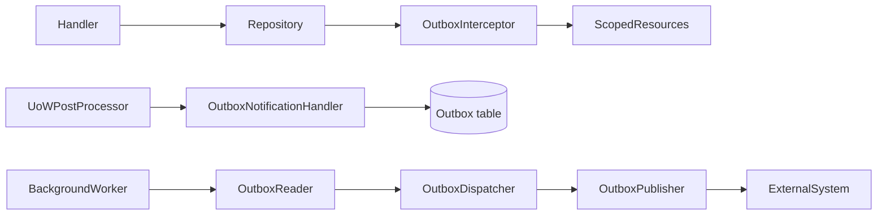

# Outbox and dispatch

The outbox pattern ensures that messages are delivered reliably even when the application restarts or a downstream service is temporarily unavailable. IDFCR provides abstractions for persisting, reading, dispatching, and publishing outbox messages.

**Packages:** `IDFCR.Abstractions.Outbox`, `IDFCR.Abstractions.Outbox.Extensions`, `IDFCR.Abstractions.Outbox.Interceptors`, `IDFCR.Outbox.EntityFramework`, `IDFCR.Outbox.Extensions`

---

## Why an outbox?

Without an outbox, a handler that writes to a database *and* sends a message faces a race: the database commit succeeds but the message send fails (or vice versa), leaving the two systems out of sync.

With an outbox:

1. The handler writes its side effects *and* inserts an outbox record in the same transaction.
2. A background worker reads pending outbox records and delivers them to the external system.
3. Delivery is at-least-once: if the worker restarts, it re-reads pending records.

---

## Outbox flow



---

## IOutboxEntity

`IOutboxEntity` is the core contract for an outbox record. Implement it on your EF Core entity:

```csharp
public interface IOutboxEntity : IAuditCreatedTimestamp, IAuditModifiedTimestamp, IIdentifiable
{
    bool IsUpdate { get; set; }
    string EntityType { get; set; }
    string? Data { get; set; }
    DateTimeOffset? CompletedTimestampUtc { get; set; }
    DateTimeOffset? FailedTimestampUtc { get; set; }
    DateTimeOffset? ProcessedTimestampUtc { get; set; }
}
```

`IOutboxEntity<TKey>` adds a typed identifier property.

### DefaultOutboxEntity

`DefaultOutboxEntity` is a ready-made implementation of `IOutboxEntity<Guid>` that you can use directly or extend:

```csharp
public sealed class MyOutboxMessage : DefaultOutboxEntity
{
    // All IOutboxEntity properties inherited
    // Add any domain-specific properties here
}
```

---

## IOutboxPublisher

`IOutboxPublisher` receives a batch of outbox records and delivers them to the external system. Implement `OutboxPublisherBase<TMessage>` to get the type-safe variant:

```csharp
public sealed class OrderEventPublisher : OutboxPublisherBase<MyOutboxMessage>
{
    private readonly IEventBus _eventBus;

    public OrderEventPublisher(IEventBus eventBus) => _eventBus = eventBus;

    public override async Task HandleAsync(
        IEnumerable<MyOutboxMessage> messages,
        CancellationToken cancellationToken)
    {
        foreach (var message in messages)
        {
            await _eventBus.PublishAsync(message.EntityType, message.Data, cancellationToken);
        }
    }
}
```

---

## IOutboxReader

`IOutboxReader` pages pending outbox records so the dispatcher can process them in batches. Implement `OutboxReaderBase<TMessage, TPagedQuery>`:

```csharp
public sealed class OrderOutboxReader(AppDbContext db)
    : OutboxReaderBase<MyOutboxMessage, GetPendingOutboxQuery>("orders")
{
    public override async Task<IPagedUnitResult<MyOutboxMessage>> GetMessagesAsync(
        GetPendingOutboxQuery request,
        CancellationToken cancellationToken)
    {
        var messages = await db.OutboxMessages
            .Where(m => m.CompletedTimestampUtc == null && m.FailedTimestampUtc == null)
            .OrderBy(m => m.CreatedTimestampUtc)
            .Skip((request.PageIndex ?? 0) * (request.PageSize ?? 10))
            .Take(request.PageSize ?? 10)
            .ToListAsync(cancellationToken);

        return PagedUnitResult.FromResult(messages, messages.Count, request);
    }

    public override async Task<IUnitResult> HasPagesAsync(
        GetPendingOutboxQuery request,
        CancellationToken cancellationToken)
    {
        var hasAny = await db.OutboxMessages
            .AnyAsync(m => m.CompletedTimestampUtc == null && m.FailedTimestampUtc == null,
                cancellationToken);

        return UnitResult.Success(hasAny ? UnitAction.Get : UnitAction.None);
    }
}
```

---

## IOutboxDispatcher

`IOutboxDispatcher` orchestrates the read → publish cycle. It calls `IOutboxReader.GetMessagesAsync`, then passes the paged result to `IOutboxPublisher.HandleAsync`.

`DefaultOutboxReaderFactory` discovers all registered `IOutboxReader` implementations and routes dispatch calls by name.

---

## Background dispatch

IDFCR provides `OutboxPipelineBase<TMessage, TPagedQuery>` (from `IDFCR.Outbox.Extensions`) as a base class for background pipelines. It manages the polling loop internally.

```csharp
using IDFCR.Outbox.Extensions.Dispatchers;
using Microsoft.Extensions.Logging;

public sealed class OrderOutboxPipeline(
    ILogger<OrderOutboxPipeline> logger,
    IServiceScopeFactory serviceScopeFactory)
    : OutboxPipelineBase<MyOutboxMessage, GetPendingOutboxQuery>(
        logger, serviceScopeFactory, delay: 5000, pageSize: 50)
{
    // Override SetFilters to customise paging or add extra query parameters
}
```

`TPagedQuery` must have a public parameterless constructor. `OutboxPipelineBase` calls `SetFilters(pageIndex, pageSize)` on each polling iteration, which you can override for custom filtering.

Register as a hosted service:

```csharp
services.AddHostedService<OrderOutboxPipeline>();
```

---

## Delivery semantics

IDFCR's outbox provides **at-least-once** delivery. Your publisher should be idempotent where possible, or use message identifiers to deduplicate on the receiving side.

Key fields for tracking delivery:

| Field | Meaning |
|---|---|
| `ProcessedTimestampUtc` | Set when the dispatcher reads the message |
| `CompletedTimestampUtc` | Set by `UnitOfWorkPostPipelineProcessor` when the commit succeeds |
| `FailedTimestampUtc` | Set by `UnitOfWorkPostPipelineProcessor` when the commit fails |

---

## Registering outbox services

IDFCR provides two registration helpers via `IDFCR.Abstractions.Outbox.Extensions`:

### Write-side (handler / interceptor)

```csharp
using IDFCR.Abstractions.Outbox.Extensions;

// Registers IOutboxEntityNotificationHandler and the OutboxInterceptor:
services.AddOutboxPattern<MyOutboxEntityNotificationHandler>();
```

### Dispatch-side (background services)

```csharp
services.AddOutboxPatternBackgroundServices<MyOutboxPipeline, MyOutboxMessage, GetPendingOutboxQuery>(
    typeof(Program).Assembly);
```

This scans the supplied assembly for `IOutboxReader`, `IOutboxPublisher`, and `IOutboxDispatcher` implementations and registers them as scoped services alongside `IOutboxReaderFactory<TMessage>`.

Implement `OutboxPipelineBase<TMessage, TPagedQuery>` (from `IDFCR.Outbox.Extensions`) for the background pipeline that calls `IOutboxReaderFactory<TMessage>` to page messages and passes them to the registered publishers.

---

## Further reading

- [Interceptors](interceptors.md) — `OutboxInterceptor` for staging messages automatically.
- [Handlers and pipelines](handlers-and-pipelines.md) — `UnitOfWorkPostPipelineProcessor` and commit lifecycle.
- [Persistence and unit of work](persistence-and-unit-of-work.md) — `IUnitOfWork` and `SaveChangesAsync`.
